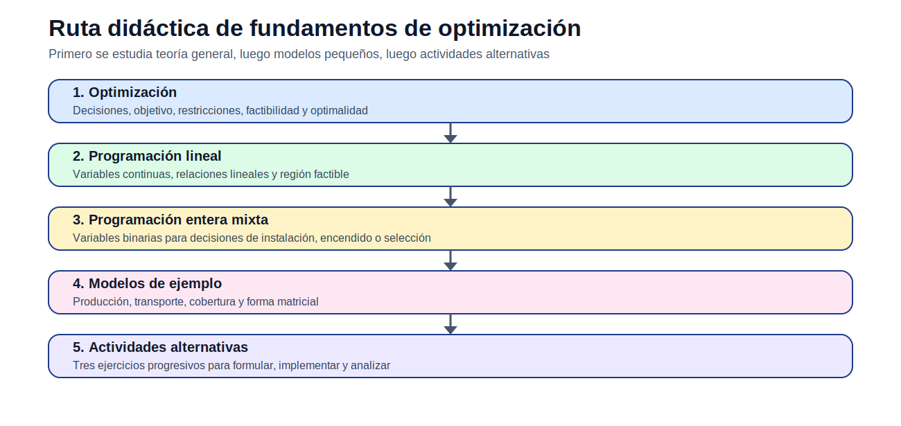
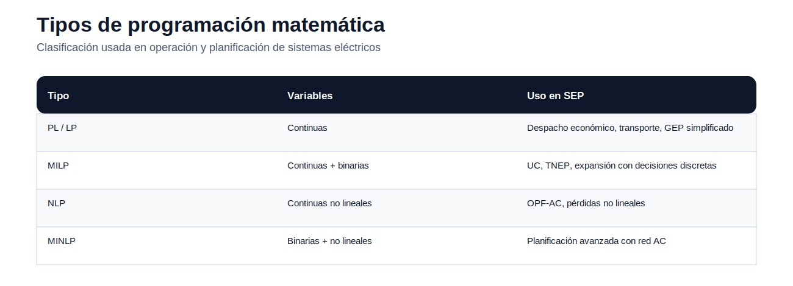

# 01 — Fundamentos de optimización

> [Menú principal](../README.md) · [Índice del sitio](../docs/index.md) · [Ruta de aprendizaje](../docs/learning_path.md) · [Modelos](../docs/modelos.md) · [Casos](../docs/casos_de_estudio.md) · [Evaluación](../docs/evaluacion.md)

## 1. Propósito del bloque

Este bloque introduce los fundamentos de optimización que se requieren para construir modelos de operación y planificación de sistemas eléctricos de potencia. Antes de estudiar despacho económico, OPF, TNEP o GEP, el estudiante debe comprender qué es una decisión, cómo se define una función objetivo, qué significa una restricción y cómo se interpreta una solución óptima.

La intención no es comenzar directamente con un caso eléctrico grande. La secuencia pedagógica es: teoría general, ejemplo pequeño, formulación matemática, implementación computacional y actividad alternativa.

## 2. ¿Qué es un problema de optimización?

Un problema de optimización busca seleccionar la mejor alternativa dentro de un conjunto de decisiones factibles. En sistemas eléctricos, estas decisiones pueden ser operativas, como cuánto genera una unidad, o de planificación, como qué línea construir o qué tecnología instalar.

La forma general es:

$$
\min_x f(x)
$$

sujeto a:

$$
g_i(x) \leq 0, \quad i \in I
$$

$$
h_j(x)=0, \quad j \in J
$$

$$
x \in \mathcal{X}
$$

donde $x$ representa las decisiones, $f(x)$ el criterio de optimización, $g_i(x)$ restricciones de desigualdad, $h_j(x)$ restricciones de igualdad y $\mathcal{X}$ el dominio de las variables.

## 3. Elementos básicos del modelo

| Elemento | Pregunta didáctica | Ejemplo en sistemas eléctricos |
|---|---|---|
| Conjuntos | ¿Qué elementos existen? | generadores, barras, líneas, periodos |
| Índices | ¿Cómo se recorre cada conjunto? | $g$, $n$, $\ell$, $t$, $y$ |
| Parámetros | ¿Qué datos son conocidos? | demanda, costos, límites, reactancias |
| Variables | ¿Qué decisiones se toman? | generación, flujo, inversión, ENS |
| Función objetivo | ¿Qué criterio se optimiza? | costo, inversión, emisiones, ENS |
| Restricciones | ¿Qué condiciones deben cumplirse? | balance, capacidad, reserva, presupuesto |

## 4. Tipos de programación matemática

| Tipo | Descripción | Ejemplo que se verá después |
|---|---|---|
| Programación lineal (PL / LP) | Variables continuas, objetivo y restricciones lineales | despacho económico lineal, transporte |
| Programación lineal entera mixta (MILP) | Combina variables continuas con variables binarias o enteras | unit commitment, TNEP, GEP discreto |
| Programación no lineal (NLP) | Incluye al menos una ecuación no lineal | OPF-AC, pérdidas no lineales |
| Programación no lineal entera mixta (MINLP) | Combina no linealidad y variables discretas | expansión avanzada con red AC |

## 5. Factibilidad, optimalidad y sensibilidad

Una solución es **factible** si cumple todas las restricciones. Es **óptima** si, además de ser factible, entrega el mejor valor de la función objetivo. En sistemas eléctricos, una solución puede ser matemáticamente óptima pero técnicamente poco útil si los datos o supuestos son incorrectos.

El análisis de sensibilidad permite responder preguntas como:

- ¿qué ocurre si aumenta la demanda?
- ¿qué recurso o restricción limita la solución?
- ¿qué alternativa entra o sale de la solución cuando cambia su costo?
- ¿qué tan robusta es la decisión frente a cambios de parámetros?

## 6. Modelos del bloque

| Modelo | Propósito | Acceso |
|---|---|---|
| Producción con recursos limitados | Comprender PL, restricciones activas y solución óptima | [Abrir](modelos/01_modelo_lineal_produccion_recursos.md) |
| Producción multiproducto indexada | Aprender a escalar un modelo con conjuntos | [Abrir](modelos/02_modelo_indexado_produccion_multiproducto.md) |
| Transporte de energía | Entender flujos, oferta, demanda y costos | [Abrir](modelos/03_modelo_transporte_energia.md) |
| Localización y cobertura | Introducir variables binarias de decisión | [Abrir](modelos/04_modelo_binario_localizacion_cobertura.md) |
| Forma matricial | Conectar notación algebraica y solver | [Abrir](modelos/05_forma_matricial_programa_lineal.md) |

## 7. Actividades del bloque

La evaluación de fundamentos se divide en tres ejercicios progresivos. Cada ejercicio deriva de un modelo revisado, pero exige una variante para que el estudiante formule y analice por su cuenta.

| Actividad | Tipo | Enlace |
|---|---|---|
| 01A — Producción lineal de componentes eléctricos | PL | [Abrir](actividades/actividad_01A_produccion_lineal.md) |
| 01B — Transporte de energía entre fuentes y cargas | PL de transporte | [Abrir](actividades/actividad_01B_transporte_energia.md) |
| 01C — Localización binaria de equipos de monitoreo | MILP | [Abrir](actividades/actividad_01C_localizacion_binaria.md) |

## 8. Preguntas de control

1. ¿Qué diferencia existe entre parámetro y variable?
2. ¿Por qué una variable binaria cambia la naturaleza del problema?
3. ¿Qué significa que una restricción esté activa?
4. ¿Por qué la factibilidad debe revisarse antes de interpretar el costo?
5. ¿Cómo se reconoce si un problema es PL, MILP, NLP o MINLP?

---

> [Menú principal](../README.md) · [Índice del sitio](../docs/index.md) · [Ruta de aprendizaje](../docs/learning_path.md) · [Modelos](../docs/modelos.md) · [Casos](../docs/casos_de_estudio.md) · [Evaluación](../docs/evaluacion.md)
