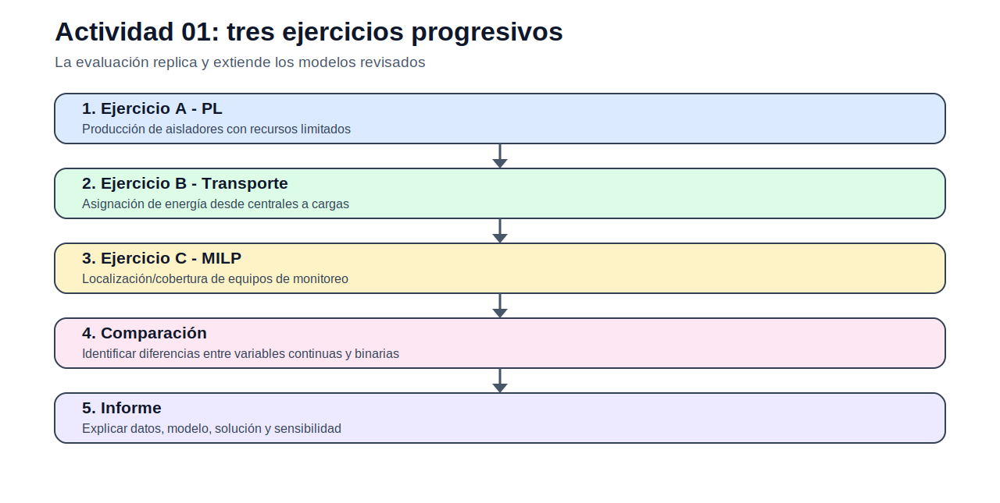

# Actividades — Fundamentos de optimización

> [Menú principal](../../README.md) · [Índice del sitio](../../docs/index.md) · [Ruta de aprendizaje](../../docs/learning_path.md) · [Modelos](../../docs/modelos.md) · [Casos](../../docs/casos_de_estudio.md) · [Evaluación](../../docs/evaluacion.md)

## Propósito

La evaluación del bloque se organiza en tres ejercicios progresivos. El objetivo no es resolver todavía un problema grande de sistemas eléctricos, sino demostrar dominio de modelación: datos, variables, función objetivo, restricciones, implementación y sensibilidad.

| Ejercicio | Modelo base | Enlace |
|---|---|---|
| A | Programación lineal de producción con recursos limitados | [actividad_01A_produccion_lineal.md](actividad_01A_produccion_lineal.md) |
| B | Modelo de transporte de energía | [actividad_01B_transporte_energia.md](actividad_01B_transporte_energia.md) |
| C | Modelo binario de localización y cobertura | [actividad_01C_localizacion_binaria.md](actividad_01C_localizacion_binaria.md) |

## Entregables comunes

- `.dat` construido desde las tablas.
- `.mod` con formulación propia.
- `.run` de ejecución.
- `.out` generado por el solver.
- Excel con resultados y sensibilidad.
- Informe técnico breve.

---

> [Menú principal](../../README.md) · [Índice del sitio](../../docs/index.md) · [Ruta de aprendizaje](../../docs/learning_path.md) · [Modelos](../../docs/modelos.md) · [Casos](../../docs/casos_de_estudio.md) · [Evaluación](../../docs/evaluacion.md)
