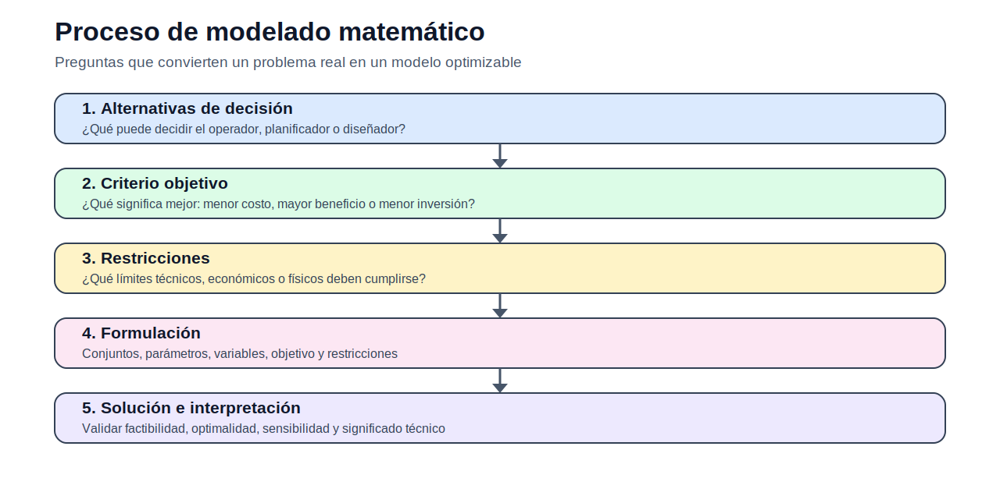
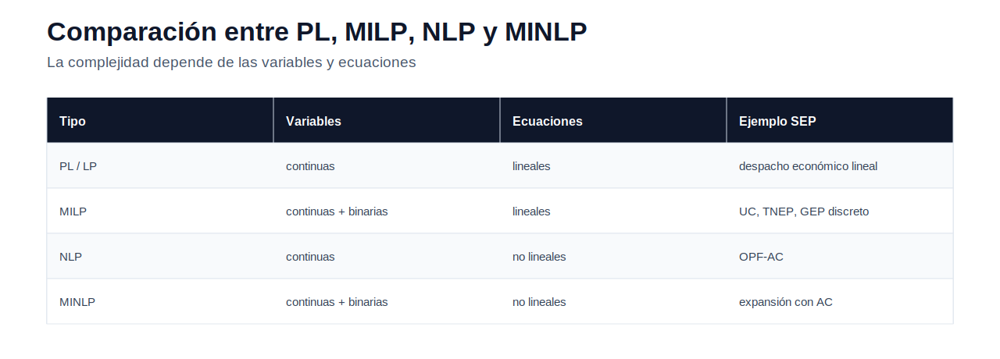

# Teoría — Fundamentos de optimización

> [Menú principal](../../README.md) · [Índice del sitio](../../docs/index.md) · [Ruta de aprendizaje](../../docs/learning_path.md) · [Modelos](../../docs/modelos.md) · [Casos](../../docs/casos_de_estudio.md) · [Evaluación](../../docs/evaluacion.md)

## 1. ¿Qué es optimización?

La optimización es el proceso de seleccionar la mejor alternativa posible dentro de un conjunto de decisiones factibles. En ingeniería eléctrica, esta idea permite formular decisiones como asignar generación, operar embalses, seleccionar líneas candidatas o instalar nueva capacidad de generación.

Un problema de optimización surge cuando existen tres elementos: alternativas de decisión, criterio objetivo y restricciones.

| Pregunta | Traducción matemática | Ejemplo en SEP |
|---|---|---|
| ¿Qué puedo decidir? | variables | generación, flujo, inversión |
| ¿Qué significa mejor? | función objetivo | menor costo total |
| ¿Qué no puedo violar? | restricciones | balance, capacidad, reserva |

## 2. Modelado matemático

Un modelo es una representación simplificada de un sistema real. No pretende capturar todo el sistema, sino conservar las relaciones necesarias para responder una pregunta técnica. Por ello, todo modelo debe declarar sus supuestos.

La forma general es:

$$
\min_x f(x)
$$

sujeto a:

$$
g_i(x) \leq 0, \quad i \in I
$$

$$
h_j(x) = 0, \quad j \in J
$$

$$
x \in \mathcal{X}
$$

## 3. Tipos de programación matemática

| Tipo | Característica | Uso didáctico |
|---|---|---|
| PL / LP | variables continuas y relaciones lineales | base para transporte, despacho y balance |
| MILP | variables continuas y enteras/binarias | decisiones de encendido, construcción o selección |
| NLP | ecuaciones no lineales | flujo óptimo AC y pérdidas no lineales |
| MINLP | enteros y no linealidad | planificación avanzada con red AC |

## 4. Factibilidad, optimalidad y sensibilidad

La solución óptima no solo debe tener el mejor valor objetivo; también debe ser factible. Una restricción activa se cumple exactamente y limita la solución. En sistemas eléctricos, una línea congestionada, un generador en su máximo, un límite de reserva o un ENS positivo son señales de restricciones relevantes.

## 5. Conexión con modelos posteriores

| Bloque posterior | Concepto heredado desde optimización |
|---|---|
| Operación | balance, costo mínimo, límites de generación |
| OPF | balance nodal, límites de líneas, variables angulares |
| TNEP | variables enteras de construcción, inversión, ENS |
| GEP | inversión, capacidad acumulada, escenarios y reserva |

## 6. Lectura recomendada

1. Leer esta teoría.
2. Revisar [modelos/README.md](../modelos/README.md).
3. Estudiar cada modelo con su contexto.
4. Resolver la [actividad 01](../actividades/README.md).

---

> [Menú principal](../../README.md) · [Índice del sitio](../../docs/index.md) · [Ruta de aprendizaje](../../docs/learning_path.md) · [Modelos](../../docs/modelos.md) · [Casos](../../docs/casos_de_estudio.md) · [Evaluación](../../docs/evaluacion.md)
