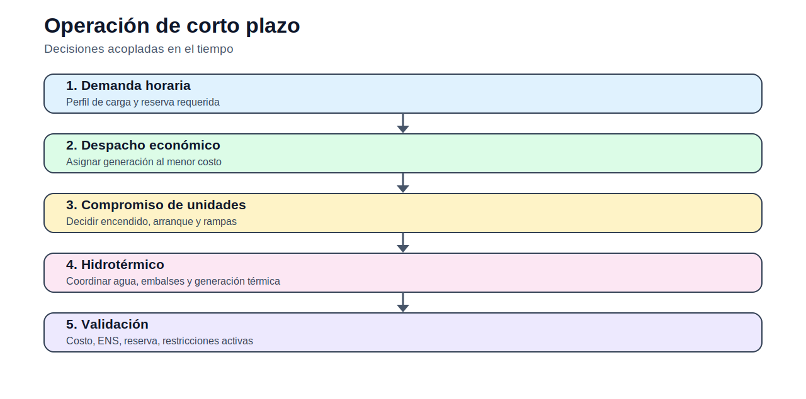

# 02 — Operación de corto plazo

> [Menú principal](../README.md) · [Índice del sitio](../docs/index.md) · [Ruta de aprendizaje](../docs/learning_path.md) · [Modelos](../docs/modelos.md) · [Casos](../docs/casos_de_estudio.md) · [Evaluación](../docs/evaluacion.md)

## 1. Contexto y propósito

La operación de corto plazo estudia decisiones horarias o diarias para abastecer demanda eléctrica. Este bloque conecta la teoría de optimización con decisiones operativas reales: generación por unidad, encendido y apagado, rampas, reserva y uso de agua en sistemas hidrotermales.

La pregunta central del bloque es: **¿cómo se opera el sistema al menor costo sin violar límites técnicos?**

## 2. Conceptos que se desarrollan

| Concepto | Uso didáctico |
|---|---|
| Despacho económico | Asignar generación al menor costo en un horizonte corto. |
| Costos por tramos | Aproximar curvas de costo mediante segmentos lineales. |
| Unit Commitment | Decidir qué unidades están encendidas y cuándo arrancan. |
| Hidrotérmico | Coordinar energía hidroeléctrica limitada y generación térmica. |

## 3. Ecuación base del bloque

La estructura común de los modelos puede leerse como una optimización de costo o inversión sujeta a balance, límites y reglas operativas:

$$
\min \; C^{op} + C^{inv} + C^{ENS}
$$

sujeto a restricciones de balance, capacidad, disponibilidad, reserva y factibilidad técnica. Cada modelo del bloque especializa esta estructura general.

## 4. Modelos del bloque

| Modelo | Acceso |
|---|---|
| Despacho económico uninodal | [Abrir](modelos/01_despacho_economico_uninodal.md) |
| Despacho económico por tramos | [Abrir](modelos/02_despacho_economico_por_tramos.md) |
| Despacho hidrotérmico simple | [Abrir](modelos/03_despacho_hidrotermico_simple.md) |
| Cascada hidroeléctrica | [Abrir](modelos/04_operacion_cascada_hidroelectrica.md) |
| Cascada con rampas | [Abrir](modelos/05_cascada_hidroelectrica_con_rampas.md) |
| Compromiso de unidades térmicas | [Abrir](modelos/06_compromiso_unidades_termicas.md) |

## 5. Actividad principal

- [Abrir actividad del bloque](actividades/actividad_02_operacion_corto_plazo.md)

## 6. Preguntas de control

1. ¿Cuál es la decisión principal del modelo?
2. ¿Qué parámetros condicionan más la solución?
3. ¿Qué restricciones podrían volverse activas?
4. ¿Qué resultado debe graficarse para interpretar la solución?
5. ¿Qué limitaciones tiene la formulación?

---

> [Menú principal](../README.md) · [Índice del sitio](../docs/index.md) · [Ruta de aprendizaje](../docs/learning_path.md) · [Modelos](../docs/modelos.md) · [Casos](../docs/casos_de_estudio.md) · [Evaluación](../docs/evaluacion.md)
