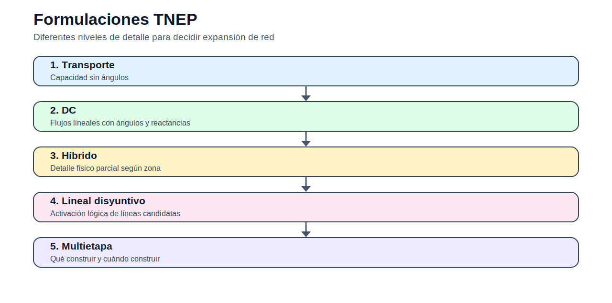

# 04 — Expansión de transmisión

> [Menú principal](../README.md) · [Índice del sitio](../docs/index.md) · [Ruta de aprendizaje](../docs/learning_path.md) · [Modelos](../docs/modelos.md) · [Casos](../docs/casos_de_estudio.md) · [Evaluación](../docs/evaluacion.md)

## 1. Contexto y propósito

La expansión de transmisión decide qué corredores reforzar o construir para que la generación pueda llegar a los centros de carga de manera segura y económica. El bloque compara formulaciones con distinto nivel de detalle físico.

La pregunta central es: **¿qué líneas deben construirse y cómo cambia la decisión según la formulación de red?**

## 2. Conceptos que se desarrollan

| Concepto | Uso didáctico |
|---|---|
| Transporte | Aproximación de capacidad sin ángulos. |
| DC | Flujos lineales con ángulos y reactancias. |
| Híbrido | Representación mixta entre detalle y simplificación. |
| Disyuntivo | Activación lógica de líneas candidatas. |
| Multietapa | Decidir qué construir y cuándo construir. |

## 3. Ecuación base del bloque

La estructura común de los modelos puede leerse como una optimización de costo o inversión sujeta a balance, límites y reglas operativas:

$$
\min \; C^{op} + C^{inv} + C^{ENS}
$$

sujeto a restricciones de balance, capacidad, disponibilidad, reserva y factibilidad técnica. Cada modelo del bloque especializa esta estructura general.

## 4. Modelos del bloque

| Modelo | Acceso |
|---|---|
| Transporte para expansión | [Abrir](modelos/01_modelo_transporte_expansion_transmision.md) |
| Refuerzo constructivo | [Abrir](modelos/02_modelo_constructivo_refuerzo_red.md) |
| DC de expansión | [Abrir](modelos/03_modelo_dc_expansion_transmision.md) |
| Híbrido | [Abrir](modelos/04_modelo_hibrido_expansion_transmision.md) |
| Lineal disyuntivo | [Abrir](modelos/05_modelo_lineal_disyuntivo_expansion_transmision.md) |
| Multietapa | [Abrir](modelos/06_modelo_multietapa_expansion_transmision.md) |

## 5. Actividad principal

- [Abrir actividad del bloque](actividades/actividad_04_tnep_garver.md)

## 6. Preguntas de control

1. ¿Cuál es la decisión principal del modelo?
2. ¿Qué parámetros condicionan más la solución?
3. ¿Qué restricciones podrían volverse activas?
4. ¿Qué resultado debe graficarse para interpretar la solución?
5. ¿Qué limitaciones tiene la formulación?

---

> [Menú principal](../README.md) · [Índice del sitio](../docs/index.md) · [Ruta de aprendizaje](../docs/learning_path.md) · [Modelos](../docs/modelos.md) · [Casos](../docs/casos_de_estudio.md) · [Evaluación](../docs/evaluacion.md)
