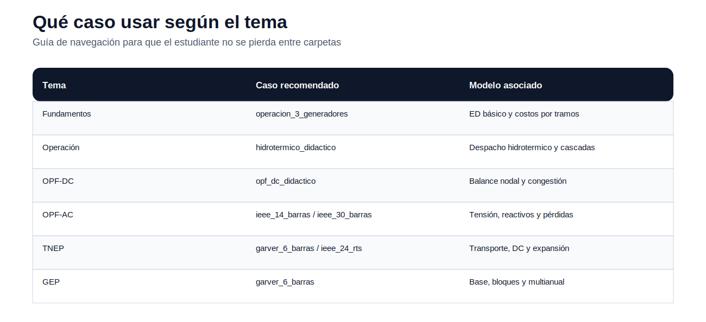

# 06 — Casos de estudio

> [Menú principal](../README.md) · [Índice del sitio](../docs/index.md) · [Ruta de aprendizaje](../docs/learning_path.md) · [Modelos](../docs/modelos.md) · [Casos](../docs/casos_de_estudio.md) · [Evaluación](../docs/evaluacion.md)

## 1. Propósito del bloque

Los casos de estudio son el puente entre modelos matemáticos y aplicaciones. No deben verse como carpetas aisladas: cada caso tiene un uso recomendado, un conjunto de datos disponible y una relación directa con uno o más temas del curso.

## 2. Qué caso usar según el tema

| Tema | Caso recomendado | Por qué se usa |
|---|---|---|
| Fundamentos / ED | [operacion_3_generadores](operacion_3_generadores/README.md) | Permite analizar despacho y costos por tramos con pocos datos |
| Operación hidrotermica | [hidrotermico_didactico](hidrotermico_didactico/README.md) | Incluye hidrotérmico simple, cascada base y rampas |
| OPF-DC | [opf_dc_didactico](opf_dc_didactico/README.md) | Permite estudiar balance nodal, ángulos y congestión |
| OPF-AC | [ieee_14_barras](ieee_14_barras/README.md) / [ieee_30_barras](ieee_30_barras/README.md) | Casos de red para tensión, reactivos y pérdidas |
| TNEP | [garver_6_barras](garver_6_barras/README.md) / [ieee_24_rts](ieee_24_rts/README.md) | Permiten comparar transporte, DC y expansión |
| GEP | [garver_6_barras](garver_6_barras/README.md) | Incluye variantes base, bloques y multianual |

## 3. Regla de uso

Antes de usar un caso, el estudiante debe responder:

1. ¿qué tema del curso estoy estudiando?
2. ¿qué modelo quiero aplicar?
3. ¿qué datos están disponibles?
4. ¿qué datos debo adaptar?
5. ¿qué resultado debo reportar?

## 4. Casos disponibles

| Caso | Estado | Tema principal |
|---|---|---|
| [Garver 6 barras](garver_6_barras/README.md) | Completo | TNEP, GEP |
| [IEEE 14 barras](ieee_14_barras/README.md) | Datos AC disponibles | OPF-AC |
| [IEEE 24 RTS](ieee_24_rts/README.md) | Parcial | TNEP / confiabilidad |
| [IEEE 30 barras](ieee_30_barras/README.md) | Datos AC disponibles | OPF-AC |
| [OPF-DC didáctico](opf_dc_didactico/README.md) | Completo | OPF-DC |
| [Operación 3 generadores](operacion_3_generadores/README.md) | Completo | ED |
| [Operación 101 generadores](operacion_101_generadores/README.md) | Completo | ED escalable |
| [Hidrotérmico didáctico](hidrotermico_didactico/README.md) | Completo | Hidrotérmico |

---

> [Menú principal](../README.md) · [Índice del sitio](../docs/index.md) · [Ruta de aprendizaje](../docs/learning_path.md) · [Modelos](../docs/modelos.md) · [Casos](../docs/casos_de_estudio.md) · [Evaluación](../docs/evaluacion.md)
