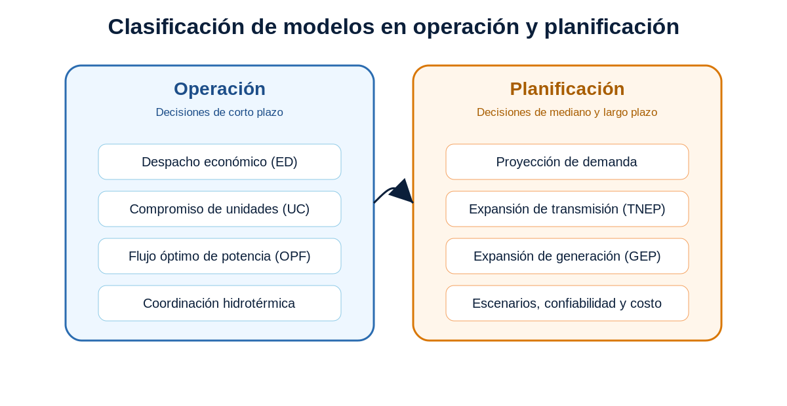
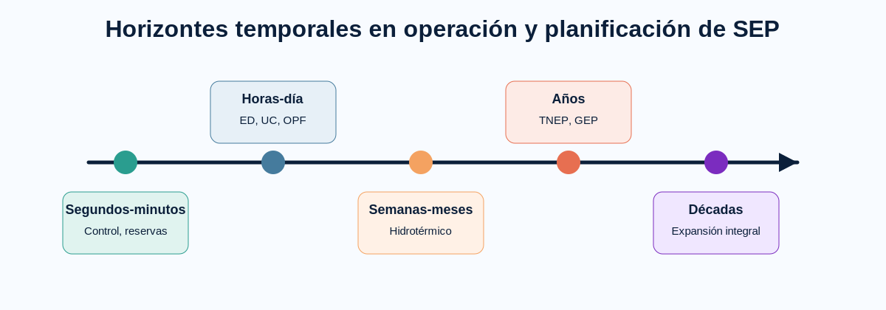

# Planificación y Operación de Sistemas Eléctricos de Potencia

Repositorio académico de apoyo a la asignatura **Planificación y Operación de Sistemas Eléctricos de Potencia**. Organiza formulaciones matemáticas, datos de prueba, casos de estudio, notebooks de exploración y actividades de modelación para estudiar problemas de operación y planificación de sistemas eléctricos.

El material está estructurado para que el estudiante transite desde la formulación matemática hasta la interpretación técnica de resultados computacionales.

## Propósito

- Presentar modelos de optimización aplicados a sistemas eléctricos de potencia.
- Explicar los modelos en términos de conjuntos, índices, parámetros, variables, función objetivo y restricciones.
- Organizar casos de prueba reutilizables para operación, OPF, TNEP y GEP.
- Facilitar el análisis de datos mediante notebooks y archivos tabulares.
- Apoyar actividades de clase, laboratorios, evaluación formativa y discusión técnica.
- Promover una lectura crítica de soluciones obtenidas mediante herramientas computacionales.

## Estructura temática

| Bloque | Carpeta | Contenido principal | Finalidad didáctica |
|---:|---|---|---|
| 1 | `01_fundamentos_optimizacion` | LP, MILP, NLP, transporte, localización | Comprender formulación matemática antes de aplicaciones eléctricas |
| 2 | `02_operacion_corto_plazo` | ED, ED por tramos, UC, despacho hidrotérmico | Modelar decisiones operativas de corto plazo |
| 3 | `03_opf_flujo_optimo_potencia` | OPF-DC, OPF-AC | Relacionar optimización con restricciones de red |
| 4 | `04_tnep_expansion_transmision` | Transporte, DC, híbrido, disyuntivo, multietapa | Decidir expansión de red y comparar formulaciones |
| 5 | `05_gep_expansion_generacion` | GEP base, estático con bloques, multianual | Decidir expansión de generación por tecnología y periodo |
| 6 | `06_casos_de_estudio` | Garver, IEEE 14, IEEE 24 RTS, IEEE 30 y casos didácticos | Reutilizar datos comunes en distintos modelos |

## Flujo de trabajo sugerido

1. Revisar la formulación matemática del bloque correspondiente.
2. Identificar conjuntos, parámetros, variables, función objetivo y restricciones.
3. Explorar el caso de estudio mediante datos y notebooks.
4. Construir los archivos `.dat`, `.mod` y `.run` solicitados por el docente.
5. Ejecutar el modelo y generar el archivo `.out`.
6. Comparar resultados, validar supuestos y responder las actividades.
7. Elaborar conclusiones técnicas sobre costo, operación, factibilidad, confiabilidad y expansión.

## Política de publicación

Este repositorio público contiene documentación, datos de prueba, notebooks y actividades. No contiene soluciones docentes completas ni modelos AMPL resueltos. Ver `SOLUCIONES_DOCENTE_PRIVADAS.md`.
