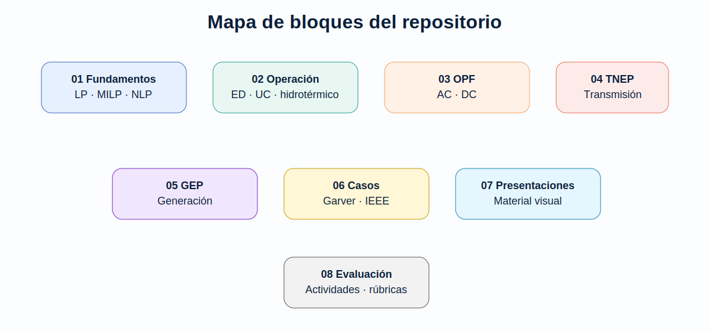

# Planificación y Operación de Sistemas Eléctricos de Potencia

Este sitio resume la estructura del repositorio académico de la asignatura. El objetivo es organizar formulaciones, casos de estudio, notebooks y actividades para apoyar el aprendizaje de modelos de operación y planificación de sistemas eléctricos de potencia.

## Organización general

| Bloque | Tema | Acceso |
|---|---|---|
| 1 | Fundamentos de optimización | [Ver carpeta](https://github.com/ESPOCH-Electricidad/power-systems-planning-operation/tree/main/01_fundamentos_optimizacion) |
| 2 | Operación de corto plazo | [Ver carpeta](https://github.com/ESPOCH-Electricidad/power-systems-planning-operation/tree/main/02_operacion_corto_plazo) |
| 3 | Flujo óptimo de potencia | [Ver carpeta](https://github.com/ESPOCH-Electricidad/power-systems-planning-operation/tree/main/03_opf_flujo_optimo_potencia) |
| 4 | Expansión de transmisión | [Ver carpeta](https://github.com/ESPOCH-Electricidad/power-systems-planning-operation/tree/main/04_tnep_expansion_transmision) |
| 5 | Expansión de generación | [Ver carpeta](https://github.com/ESPOCH-Electricidad/power-systems-planning-operation/tree/main/05_gep_expansion_generacion) |
| 6 | Casos de estudio | [Ver carpeta](https://github.com/ESPOCH-Electricidad/power-systems-planning-operation/tree/main/06_casos_de_estudio) |
| 7 | Presentaciones | [Ver carpeta](https://github.com/ESPOCH-Electricidad/power-systems-planning-operation/tree/main/07_presentaciones) |
| 8 | Actividades y evaluación | [Ver carpeta](https://github.com/ESPOCH-Electricidad/power-systems-planning-operation/tree/main/08_actividades_y_evaluacion) |

## Enfoque de la asignatura

La operación y la planificación se diferencian por el horizonte temporal, las variables de decisión y el tipo de restricciones. En operación predominan decisiones de despacho, compromiso de unidades y factibilidad de red. En planificación aparecen decisiones de inversión en generación, transmisión y recursos energéticos.

## Recursos destacados

- [Clasificación de operación y planificación](introduccion_operacion_planificacion.md)
- [Guía de casos de estudio](casos_de_estudio.md)
- [Guía de evaluación](evaluacion.md)
- [Presentaciones de apoyo](https://github.com/ESPOCH-Electricidad/power-systems-planning-operation/tree/main/07_presentaciones)
