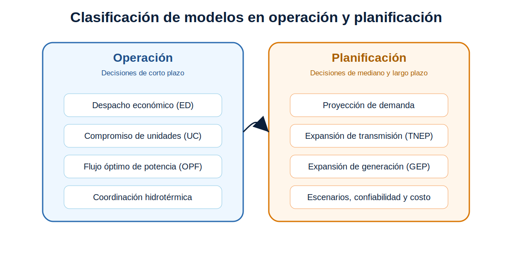
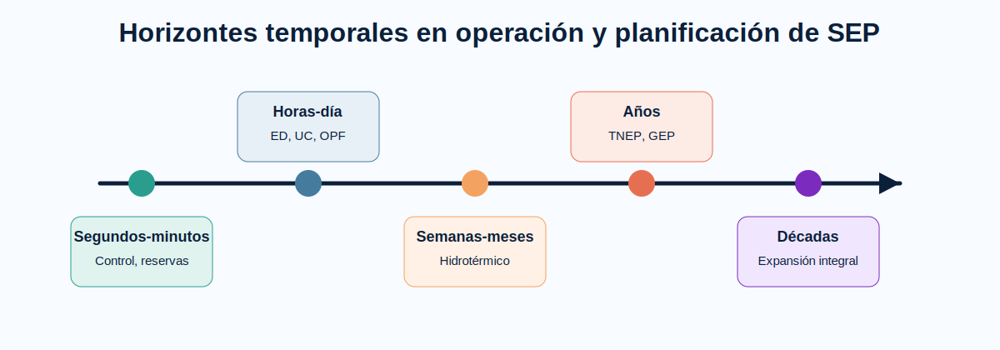

# Introducción a la operación y planificación de SEP

La operación y la planificación de sistemas eléctricos de potencia agrupan problemas de decisión con diferentes horizontes, restricciones y objetivos.

## Operación

La operación se concentra en decisiones de corto plazo: despacho económico, compromiso de unidades, flujo óptimo de potencia y coordinación hidrotérmica. El objetivo usual es atender la demanda con mínimo costo operativo, respetando límites técnicos y restricciones de seguridad.

## Planificación

La planificación estudia decisiones de mediano y largo plazo: expansión de generación, expansión de transmisión, incorporación de renovables, reserva, confiabilidad y costos de inversión. El objetivo es determinar qué recursos deben incorporarse, cuándo y bajo qué criterios técnicos y económicos.

## Relación entre horizontes

Un plan de expansión debe ser validado mediante modelos de operación. Por ejemplo, una expansión de generación puede ser económicamente atractiva, pero su factibilidad debe analizarse considerando red, restricciones operativas, reserva y escenarios de demanda.
